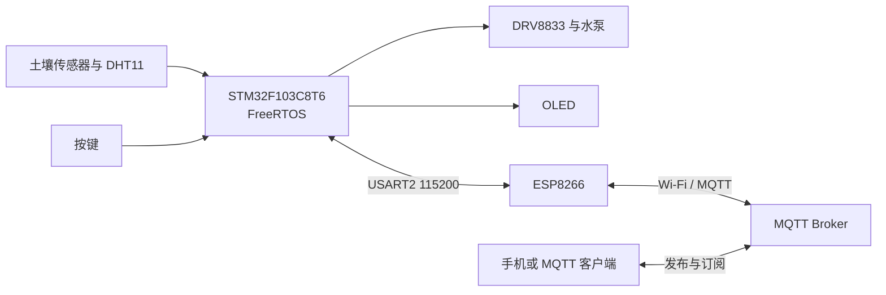

# 基于 FreeRTOS 与 MQTT 的智能浇花控制终端

本项目把原来的 STM32 裸机轮询程序拆分为 FreeRTOS 多任务程序，并使用 ESP8266 作为串口到 MQTT 的网络桥。STM32 负责传感器采集、自动控制、按键和 OLED；ESP8266 负责 Wi-Fi、MQTT 连接、订阅和发布。

## 系统结构



## FreeRTOS 任务

| 任务 | 优先级 | 周期/触发 | 职责 |
| --- | ---: | --- | --- |
| `ControlTask` | 4 | 100 ms | 自动/手动控制、回差、报警、水泵超时保护 |
| `SensorTask` | 3 | 土壤 500 ms；DHT11 2 s | 采样并更新共享快照 |
| `CommTask` | 3 | 20 ms；上报 2 s | 解析远程命令、向 ESP8266 发送遥测 |
| `KeyTask` | 2 | 30 ms | 扫描按键并向控制队列发送命令 |
| `DisplayTask` | 1 | 200 ms | 从共享快照刷新 OLED |

任务之间通过一个命令队列和受互斥锁保护的状态快照通信。控制任务是水泵状态的唯一写入者，避免多个任务同时改 GPIO。

## STM32 与 ESP8266 串口协议

ESP8266 运行项目自带的 Arduino 固件，不依赖原厂 AT 固件。两颗 MCU 上电后直接通过 USART2 传输二进制帧：

```text
A5 5A | Version | Type | Sequence | Flags | Length | Payload | CRC16
```

| Type | 方向 | 内容 |
| --- | --- | --- |
| `0x01` | 双向 | 心跳请求和回复 |
| `0x10` | STM32 → ESP8266 | 温度、湿度、土壤湿度、ADC、模式、水泵、报警 |
| `0x20` | ESP8266 → STM32 | 控制命令和参数 |
| `0x21` | STM32 → ESP8266 | 命令执行结果与实际值 |
| `0x30` | ESP8266 → STM32 | MQTT 在线状态 |

接收端逐字节寻找帧头，根据 `Length` 等待完整数据，并用 CRC-16/CCITT 检查传输完整性。

## MQTT 数据流

- 上报：传感器 → `SensorTask` → 状态快照 → `CommTask` → USART2 → ESP8266 → MQTT 数据主题。
- 控制：手机发布控制主题 → Broker → ESP8266 订阅回调 → USART2 → `CommTask` → 命令队列 → `ControlTask` → 水泵。
- ESP8266 每 5 秒尝试一次 MQTT 重连，并通过 `0x30` 二进制帧向 STM32 报告在线状态。
- 公共 Broker 默认主题为 `jiaohua/<设备命名空间>/data` 和 `jiaohua/<设备命名空间>/control`。
- 遥测主题使用 JSON；控制主题使用简短文本命令；应答发布到 `jiaohua/<设备命名空间>/ack`。

## 编译

### STM32

1. 用 Keil MDK 5 打开 `firmware/stm32/USER/LCD.uvprojx`。
2. 选择目标 `JiaoHua-RTOS`。
3. 编译后生成 `firmware/stm32/OBJ/JiaoHuaRTOS.hex`。

### ESP8266

1. Arduino IDE 安装 ESP8266 开发板支持和 `PubSubClient` 库。
2. 打开 `firmware/esp8266/ESP8266_MQTT_Bridge/ESP8266_MQTT_Bridge.ino`。
3. 选择实际 ESP8266 板型并编译、下载。

## 本地配置

真实 Wi-Fi 密码和云端密钥不会提交到 Git。复制
`firmware/esp8266/ESP8266_MQTT_Bridge/bridge_config.example.h` 为
`bridge_config.h`，然后填写本地配置。


## 上板前检查

- PCB 上应安装与原理图引脚一致的 **DRV8833** 驱动模块。TB6612 模块不能按该插座直接替换。
- 土壤换算中的 `SOIL_ADC_DRY=1843`、`SOIL_ADC_WET=410` 来自初步测试。需要在实际花盆中重新测量干土和充分湿润土壤的 ADC 值。
- 首次烧录先断开水泵或使用限流电源，确认 OLED、按键、传感器和 PB14 控制电平，再接水泵测试。

## 电脑端联合测试

烧录两颗 MCU 后，可以先运行 `tools/mqtt_monitor.ps1` 查看数据和控制应答，
再用 `tools/mqtt_command.ps1` 发送命令。例如：

```powershell
.\tools\mqtt_command.ps1 -Command manual
.\tools\mqtt_command.ps1 -Command pump-on
.\tools\mqtt_command.ps1 -Command pump-off
.\tools\mqtt_command.ps1 -Command soil -Value 40
```

## 当前验证状态

- STM32 Keil ARMCC5：已通过完整构建，0 errors、0 warnings。
- MQTT 桥的基础版本曾在实物上连通；本次重连与状态上报改动需要重新烧录 ESP8266 做联合验证。
- FreeRTOS 版本尚未烧录到实物，因此不能把“编译通过”等同于“整机完成”。
